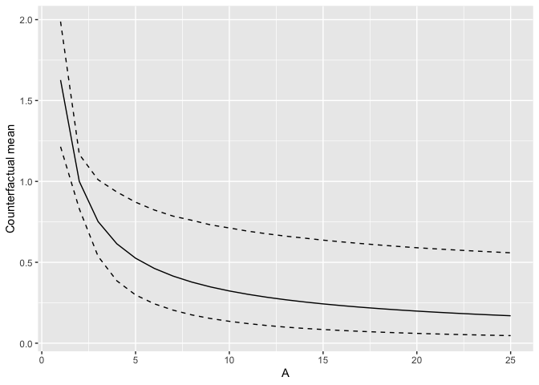

<!-- README.md is generated from README.Rmd. Please edit that file -->

# TargetedMSM

<!-- badges: start -->

[](https://github.com/herbps10/TargetedMSM/actions/workflows/R-CMD-check.yaml)
<!-- badges: end -->

Targeted estimation for a general class of Non-parametric Marginal
Structural Models (NP-MSMs)

## Installation

You can install the development version of TargetedMSM from
[GitHub](https://github.com/) with:

``` r
# install.packages("pak")
pak::pak("herbps10/TargetedMSM")
```

## Example

Estimate a linear working model with squared error loss function for
summarizing a dose-response curve:

``` r
library(TargetedMSM)

set.seed(10016)
data <- simulate_categorical_dose_response(N = 500)

fit <- categorical_dose_response(
  data,
  c("X1", "X2"),
  "A",
  "Y",
  formula = ~1 + A,
  outcome_type = "continuous",
  learners_trt = c("SL.glm.interaction"),
  learners_outcome = c("SL.glm.interaction"),
  loss = loss_squared_error,
  working_model = function(beta, X) beta[1]$mul(X[, 2]$pow(beta[2]))
)
#> Loading required package: nnls
#> TMLE iteration: 1, max(epsilon): -0.0119739724323153
#> TMLE iteration: 2, max(epsilon): 2.02724477276206e-05

summary(fit)
#> Marginal Structural Model: Categorical Dose-Response Function
#> One-step estimator
#>     Est      SE    2.5%   97.5%
#>    1.83    0.25    1.34    2.32 
#>   -0.99    0.12   -1.22   -0.76 
#> TMLE estimator
#>     Est      SE    2.5%   97.5%
#>    1.63     0.2    1.23    2.02 
#>    -0.7    0.24   -1.16   -0.24
```

Predict from the estimated NP-MSM and plot results:

``` r
library(purrr)
library(ggplot2)
#> Warning: package 'ggplot2' was built under R version 4.5.2

pred <- data.frame(A = 1:25)
pred$point <- predict(fit, pred)
pred$lower <- map_dbl(predict(fit, pred, type = "joint"), quantile, 0.025)
pred$upper <- map_dbl(predict(fit, pred, type = "joint"), quantile, 0.975)

ggplot(pred, aes(A, point)) +
  geom_line() +
  geom_line(aes(y = lower), lty = 2) +
  geom_line(aes(y = upper), lty = 2) +
  labs(x = "A", y = "Counterfactual mean", main = "Estimated dose-response curve")
#> Ignoring unknown labels:
#> • main : "Estimated dose-response curve"
```



Estimating a linear working model with squared error loss function for
summarizing Conditional Average Treatment Effects:

``` r
set.seed(10016)
data <- simulate_treatment_effect_modification(N = 500)

fit <- treatment_effect_modification(
  data,
  c("X1", "X2"),
  "A",
  "Y",
  formula = ~1 + X2,
  outcome_type = "continuous",
  learners_trt = c("SL.glm.interaction"),
  learners_outcome = c("SL.glm.interaction"),
  loss = loss_squared_error,
  working_model = working_model_linear
)

summary(fit)
#> Marginal Structural Model: Treatment Effect Modification
#> One-step estimator
#>     Est      SE    2.5%   97.5%
#>    0.01    0.02   -0.03    0.04 
#>    1.03    0.04    0.96    1.09 
#> TMLE estimator
#>     Est      SE    2.5%   97.5%
#>       0    0.02   -0.04    0.04 
#>    1.03    0.04    0.96     1.1
```
